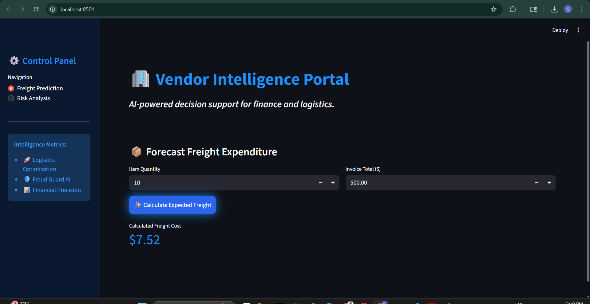
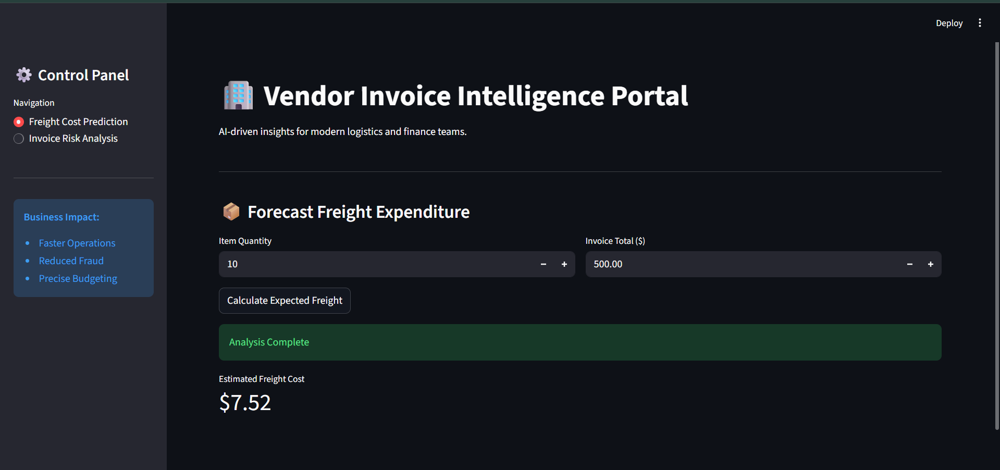

# 📊 Vendor Invoice Intelligence System
> **AI-Driven Freight Cost Prediction & Invoice Risk Flagging**


---
# Vendor Invoice Intelligence System  
### Freight Cost Prediction + Invoice Risk Flagging

---

## Demo Video

> Add your Streamlit application demo video below

[](PASTE_VIDEO_LINK_HERE)

---

# Project Overview

The **Vendor Invoice Intelligence System** is an end-to-end Machine Learning project developed to automate vendor invoice analysis for finance and operations teams.

The system focuses on two major business problems:

- Predicting expected freight costs for vendor invoices
- Automatically identifying risky or suspicious invoices that may require manual review

The project combines:
- SQL-based data extraction,
- Feature engineering,
- Statistical analysis,
- Machine Learning modeling,
- Hyperparameter tuning,
- Inference pipelines,
- Streamlit-based deployment

to build a production-oriented intelligent invoice processing system.
## 🌐 Live Deployed Application  
🔗(https://invoice-intelligence-system-ichmfea6brs3spf5vrphzp.streamlit.app/)

---

# Business Problem

Organizations process thousands of vendor invoices regularly. Manual invoice verification is often:

- Time-consuming,
- Error-prone,
- Difficult to scale,
- Inefficient for anomaly detection.

Additionally:
- Freight costs are difficult to estimate manually,
- Abnormal invoices may go unnoticed,
- Financial mismatches can impact operational efficiency.

This project addresses these challenges using Machine Learning-based automation.

---

# Business Objectives

The primary objectives of the system are:

- Predict expected freight cost using invoice information
- Automatically flag suspicious invoices
- Reduce manual review workload
- Improve operational efficiency
- Assist finance teams in identifying anomalies early
- Support intelligent invoice validation workflows

---

# Streamlit Web Application

A Streamlit-based interactive application was developed for business users.

### Features
- Freight Cost Prediction
- Invoice Risk Detection
- Interactive UI
- Real-time prediction system

---

## Module 1 — Freight Cost Prediction

This module predicts the expected freight cost using invoice-related information such as quantity and invoice dollars.

### Inputs
- Invoice Quantity
- Invoice Dollars

### Output
- Predicted Freight Cost

### Screenshot

```markdown



```

---

## Module 2 — Invoice Risk Flagging

This module predicts whether an invoice is safe or requires manual review based on operational and financial metrics.

### Inputs
- Quantities
- Invoice Dollars
- Freight Cost
- Delay Features

### Outputs
- ✅ Safe Invoice
- ⚠️ Manual Review Required

### Screenshot

```markdown

```
---

# Technologies Used

| Technology | Purpose |
|---|---|
| Python | Core programming language |
| Pandas | Data manipulation |
| NumPy | Numerical operations |
| SQLite | Relational database |
| Scikit-learn | Machine Learning models |
| Streamlit | Web application |
| Joblib | Model serialization |
| Matplotlib | Data visualization |
| Seaborn | Correlation heatmaps |

---

# Dataset and Database

## Data Source
Relational SQLite Database

---

## Tables Used

### Purchase Table

Contains:
- Purchase order number
- Quantity
- Dollars
- Receiving date
- Purchase order date
- Brand information

---

### Vendor Invoice Table

Contains:
- Invoice quantity
- Invoice dollars
- Freight cost
- Invoice date
- Payment date

---

# SQL Data Extraction

Data was extracted using:

```python
pd.read_sql_query()
```

SQL operations used:
- `SUM()`
- `AVG()`
- `COUNT()`
- `GROUP BY`
- `LEFT JOIN`

---

# Feature Engineering

Several business-focused features were created, including:

- Total item quantity
- Total item dollars
- Total brands
- Average receiving delay
- Days from PO to Invoice
- Days to Payment

---

# Date Handling

Date columns were originally stored as object/string format.

The SQLite `julianday()` function was used to:
- Convert dates,
- Calculate delays,
- Generate time-based analytical features.

Example:
```sql
julianday(receiving_date) - julianday(po_date)
```

---

# Label Creation for Classification

Supervised Machine Learning requires labeled target variables.

Invoices were flagged using rule-based business conditions:

### Invoice flagged if:
- Invoice total mismatch exists
OR
- Average receiving delay > 10 days

### Labels
| Label | Meaning |
|---|---|
| 1 | Risky Invoice |
| 0 | Normal Invoice |

---

# Exploratory Data Analysis (EDA)

EDA was performed to:
- Understand invoice behavior,
- Detect correlations,
- Identify feature importance,
- Compare risky vs normal invoices.

### Techniques Used
- Correlation heatmaps
- Statistical analysis
- Distribution plots
- T-Test hypothesis testing

---

# Statistical Testing

T-Test was applied to compare:
- Risky invoices
- Normal invoices

### Purpose
Identify statistically significant features.

### Decision Rule
- `p-value < 0.05` → Significant Feature
- `p-value > 0.05` → Non-significant Feature

Features such as:
- Days to Pay
- Total Brands

were removed due to low significance.

---

# Feature Scaling

Since feature ranges varied significantly:
- Dollars in millions
- Delays in days

Feature scaling was required.

### Scaling Techniques Used
- StandardScaler
- MinMaxScaler

---

# Machine Learning Models Used

| Model | Purpose |
|---|---|
| Logistic Regression | Baseline model |
| Decision Tree Classifier | Rule-based classification |
| Random Forest Classifier | Final optimized model |

---

# Model Optimization

## Hyperparameter Tuning

Used:
```python
GridSearchCV
```

### Parameters Tuned
- Criterion
- Max Depth
- Min Samples Split
- Min Samples Leaf
- Number of Estimators

---

## Cross Validation

Implemented:
- 5-Fold Cross Validation

### Benefits
- Better generalization
- Reduced overfitting
- More stable performance

---

# Final Model Performance

| Metric | Result |
|---|---|
| Final Accuracy | 89% |
| Best Model | Random Forest Classifier |

### Improvements Achieved
- Reduced false positives
- Better feature selection
- Improved prediction reliability

---

# Feature Importance Analysis

Random Forest Feature Importance was used to identify:
- Most important predictors
- Least useful features

Low-importance features were removed to improve performance and reduce noise.

---

# Model Serialization

The final optimized model was saved using:
- Joblib
- Pickle

Saved components:
- Trained model
- Feature scaler

---

# Project Architecture

The project follows a modular architecture with separate layers for:

- Data preprocessing
- Model training
- Evaluation
- Inference
- Deployment

---

# Project Structure

```bash
Vendor-Invoice-Intelligence-System/
│
├── invoice_flagging/
│   ├── data_preprocessing.py
│   ├── modeling_evaluation.py
│   ├── train.py
│   ├── models/
│   └── inference/
│
├── app.py
├── notebooks/
├── screenshots/
└── requirements.txt
```

---

# Training Pipeline

The training workflow includes:

1. Loading invoice data
2. Creating labels
3. Feature engineering
4. Scaling features
5. Training models
6. Hyperparameter tuning
7. Model evaluation
8. Saving best model

---

# Inference Pipeline

The inference system:
- Loads saved models,
- Accepts new invoice inputs,
- Generates predictions dynamically.

This simulates real-world production prediction systems.

---

# Streamlit Web Application

A Streamlit-based interactive application was developed for business users.

### Features
- Freight Cost Prediction
- Invoice Risk Detection
- Interactive UI
- Real-time prediction system

---

# Streamlit Application Screenshots

## Freight Cost Prediction Module

> Add screenshot below

```markdown

```

---

## Invoice Risk Flagging Module

> Add screenshot below

```markdown

```

---

# Key Technical Learnings

This project provided practical exposure to:

- SQL feature engineering
- Statistical testing
- Classification models
- Feature selection
- Hyperparameter tuning
- Cross validation
- Model serialization
- Inference pipelines
- Streamlit deployment
- MLOps fundamentals

---

# Business Learnings

The project demonstrated how Machine Learning supports:

- Financial anomaly detection
- Vendor invoice validation
- Operational automation
- Risk reduction
- Decision support systems

---

# Future Improvements

Potential future enhancements include:

- Real-time REST APIs
- Cloud deployment (AWS/Azure/GCP)
- MLflow integration
- Airflow workflow automation
- Advanced anomaly detection
- Deep learning models
- Auto-retraining pipelines
- ERP integration

---

# Conclusion

The Vendor Invoice Intelligence System successfully developed a complete end-to-end Machine Learning workflow for intelligent invoice analysis.

The system:
- Predicts freight costs,
- Detects risky invoices,
- Automates invoice validation workflows,
- Supports operational decision-making.

### Final Achievement
- Achieved **89% classification accuracy**
- Reduced false positives
- Improved operational efficiency
- Created a scalable ML pipeline architecture

The project demonstrates how Machine Learning can transform raw business data into deployable intelligent systems capable of improving financial operations and reducing manual effort.

---

# Author

## Sanyogita Rajput

Computer Science Engineering Student  
VIT Bhopal University

### Skills
- Machine Learning
- Python
- SQL
- Data Analysis
- Streamlit
- UI/UX Design

---

# Contact

### LinkedIn
ADD_LINKEDIN_LINK

### GitHub
ADD_GITHUB_LINK

### Email
ADD_EMAIL
